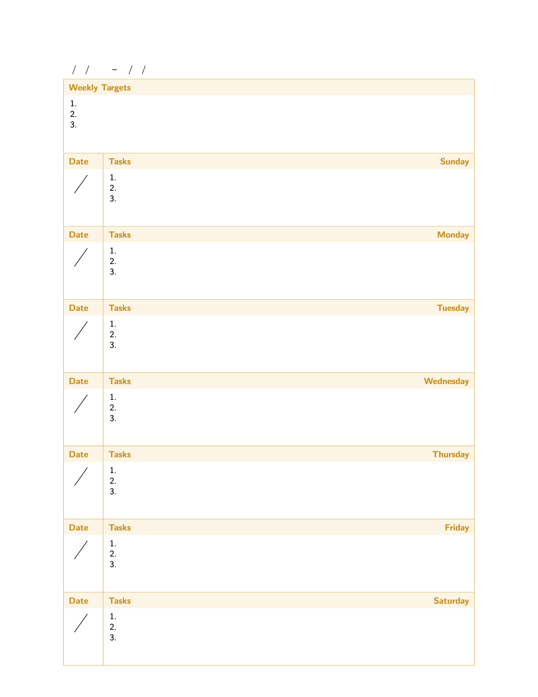

Weekly planner made with LaTeX.

The planner comes with six colours, which could be easily modified in planner.tex: 

-  `#D70800` Red
-  `#FFE6E5` Light Red
-  `#D79000` Orange
-  `#FFF5E5` Light Orange
-  `#B9BC00` Yellow
-  `#FEFFE5` Light Yellow
-  `#0AD700` Green
-  `#E5FFE5` Light Green
-  `#008ED7` Blue
-  `#e5f7ff` Light Blue
-  `#5600D7` Purple
-  `#F0E5FF` Light Purple

